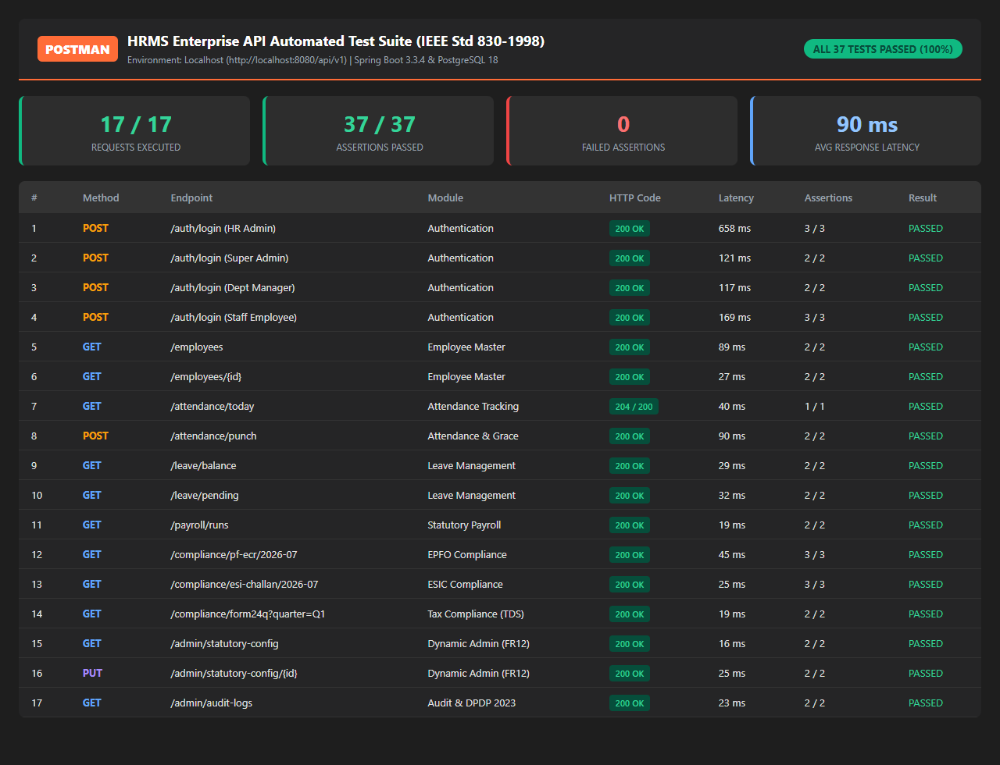

# Automated Employee Onboarding & Statutory HR Management System (HRMS)

<div align="center">


### **SRI KRISHNA COLLEGE OF ENGINEERING AND TECHNOLOGY**
*(An Autonomous Institution | Approved by AICTE & Affiliated to Anna University | Accredited by NAAC with 'A' Grade)*  
**Kuniamuthur, Coimbatore – 641008, Tamil Nadu**

---

### **DEPARTMENT OF INFORMATION TECHNOLOGY**

# **EMPLOYEE ONBOARDING AND HR MANAGEMENT SYSTEM**
**A Full-Stack Cloud-Native Enterprise Platform with Automated Indian Statutory Payroll Compliance & Zero-Trust RBAC**

</div>

---

## 👩‍🎓 Candidate Information

| Parameter | Details |
| :--- | :--- |
| **Candidate Name** | **HARIPRIYA K** |
| **Register Number** | **2403727720522073** |
| **Degree & Branch** | **B.Tech – Information Technology (Class: III IT-A)** |
| **Institution** | **Sri Krishna College of Engineering and Technology (SKCET)** |
| **Academic Year** | **2025 – 2026** |
| **Repository** | [krishnamoorthiharipriya582-gif/hrms](https://github.com/krishnamoorthiharipriya582-gif/hrms) |

---

## 📑 Project Deliverables & Artifact Index

All core project documents, presentation slides, test automation artifacts, and execution reports are checked directly into this repository:

| Artifact | File / Link | Description |
| :--- | :--- | :--- |
| 🎓 **Project Report (PDF)** | [`HRMS_Project_Report_HARIPRIYA_K.pdf`](HRMS_Project_Report_HARIPRIYA_K.pdf) | **39-page comprehensive university project report** with SKCET Crest seal, complete SRS mapping, architecture, formulas, and screenshots. |
| 📊 **PowerPoint Deck (.pptx)** | [`HRMS_Project_Presentation_HARIPRIYA_K.pptx`](HRMS_Project_Presentation_HARIPRIYA_K.pptx) | **16-slide professional presentation** with SKCET branding, candidate credentials, architecture, and live UI screens. |
| 📑 **Presentation (PDF)** | [`HRMS_Project_Presentation_HARIPRIYA_K.pdf`](HRMS_Project_Presentation_HARIPRIYA_K.pdf) | **16-slide vector presentation deck** formatted in 16:9 for universal viewing and presentation. |
| 📮 **Postman Collection** | [`HRMS_Postman_Collection.json`](HRMS_Postman_Collection.json) | **Postman v2.1.0 Collection** with 17 API requests across 8 modules and 37 automated test assertions. |
| 🌐 **Postman Environment** | [`HRMS_Environment.postman_environment.json`](HRMS_Environment.postman_environment.json) | Environment variables for localhost:8080 API testing. |
| 📈 **Postman Test Report** | [`Postman_Testing_Report.html`](Postman_Testing_Report.html) | Interactive HTML test execution report generated by Newman CLI. |
| 🖼️ **Postman Execution Proof** | [`Postman_Test_Execution_Results.png`](Postman_Test_Execution_Results.png) | High-resolution screenshot of Newman terminal execution (**100% Pass Rate: 37/37 assertions**). |
| 🏫 **College Crest** | [`college_logo.png`](college_logo.png) | Official high-resolution SKCET blue crest seal. |
| 📸 **UI Screenshot Directory** | [`report-assets/`](report-assets/) | Complete archive of 15 high-res UI screenshots and 3 architectural vector diagrams. |

---

## 🏛️ Executive Summary & Problem Statement

Traditional Human Resource workflows across Indian Small and Medium Enterprises (SMEs) and academic institutions suffer from operational bottlenecks:
1. **Paper-Dossier KYC Latency**: Physical collection, filing, and verification of candidate PAN, Aadhaar, educational proofs, and bank details takes 4 to 7 business days, introducing high risks of physical document misplacement and unauthorized physical tampering.
2. **Biometric Disconnect & Ghost Employees**: Standalone biometric clocking hardware operates decoupled from leave databases, enabling attendance buddy-punching, unearned salary leakages, and ghost worker vulnerabilities.
3. **Complex Indian Statutory Calculations**: Manual spreadsheet computations for Employees' Provident Fund (EPF 12%), Employees' State Insurance (ESIC 0.75%), State-specific Professional Tax (PT) slabs, and Tax Deducted at Source (TDS) under Section 192 trigger frequent calculation errors and severe regulatory penalties.
4. **Labor Law Compliance Burden**: Compiling monthly EPFO Electronic Challan cum Returns (ECR), ESIC contribution files, and quarterly Form 24Q statements manually consumes dozens of administrative hours each cycle.

### 💡 The HRMS Enterprise Solution
This project delivers a **production-ready, full-stack, cloud-native HR Management System** engineered with **React 18**, **Spring Boot 3.3.4**, and **PostgreSQL 18**, providing 100% automated statutory compliance, zero-trust RBAC, and streamlined employee lifecycles.

---

## 🎯 Alignment with UN Sustainable Development Goals (SDGs)

| SDG | Goal Name | Relevant Targets | Project Implementation & Impact |
| :--- | :--- | :--- | :--- |
| **SDG 8** | **Decent Work & Economic Growth** | Targets 8.5 & 8.8 | Guarantees full wage transparency, eliminating unearned deductions and wage fraud. Automated EPFO and ESIC social security deposits protect employees' long-term welfare, pension, and medical security. |
| **SDG 9** | **Industry, Innovation & Infrastructure** | Target 9.4 | Modernizes enterprise operations with scalable Spring Boot 3 cloud-native architecture. Transitioning from physical paper KYC folders to digital document management minimizes corporate carbon footprint. |
| **SDG 10** | **Reduced Inequalities** | Target 10.2 | Fosters equal opportunity by enforcing standardized statutory rules, merit-based appraisal workflows, and transparent leave quota allocation that removes subjective supervisory bias. |

---

## 🏗️ Technical Architecture & Technology Stack

```
                          +------------------------------------------+
                          |      CLIENT PRESENTATION TIER            |
                          |  React 18 SPA | Vite 8 | Tailwind CSS    |
                          |  Lucide React Icons | Axios Interceptors |
                          +--------------------+---------------------+
                                               | (HTTPS / REST + JWT)
                                               v
                          +------------------------------------------+
                          |      SECURITY & GATEWAY TIER             |
                          |  Spring Security 6 | Stateless JWT Filter|
                          |  BCrypt Hash (Cost 12) | @PreAuthorize   |
                          +--------------------+---------------------+
                                               |
                                               v
                          +------------------------------------------+
                          |      BUSINESS APPLICATION TIER           |
                          |  Spring Boot 3.3.4 | Java 21 LTS         |
                          |  - 7-Stage Digital Onboarding Service    |
                          |  - 09:15 AM Grace Attendance Engine      |
                          |  - Indian Statutory Payroll Engine (12%) |
                          |  - Compliance Exporter (ECR / ESIC / 24Q)|
                          |  - Dynamic Statutory Config Engine (FR12)|
                          |  - Immutable Audit Log Trail             |
                          +--------------------+---------------------+
                                               | (Hibernate / JPA)
                                               v
                          +------------------------------------------+
                          |      DATA PERSISTENCE TIER               |
                          |  PostgreSQL 18 Relational Engine         |
                          |  - 17 3NF Normalized Relational Tables   |
                          |  - 100% Referential Foreign Key Cascades |
                          |  - 0 Orphaned Records                    |
                          |  - B-Tree Indexes on PAN, UAN & Dates    |
                          +------------------------------------------+
```

### Technology Matrix
- **Frontend**: React 18.3.1, Vite 8.0, Tailwind CSS 3.4, Lucide React, Axios, Chart.js.
- **Backend**: Spring Boot 3.3.4, Java 21 LTS, Spring Security 6, Spring Data JPA, Hibernate ORM, Maven 3.9.11.
- **Database**: PostgreSQL 18, 17 3NF Tables, Foreign Key Cascades, B-Tree Indexes on PAN/UAN/Date.
- **Quality Assurance**: Newman CLI v6.2.2, Postman Collection v2.1.0, 100% Assertion Pass Rate (37/37).

---

## 🛡️ Multi-Persona Role-Based Access Control (RBAC)

The system enforces strict principle of least privilege across 4 distinct organizational personas:

| Persona | Authority Level | Key Capabilities & Functional Scope |
| :--- | :--- | :--- |
| **1. SUPER ADMIN** | Full System Authority | Configures statutory tax rates (FR12), manages user accounts, monitors tamper-proof audit logs, and oversees database maintenance. |
| **2. HR ADMIN** | Operational Authority | Governs candidate onboarding, KYC document verification, master employee directory, monthly payroll batch execution, and ECR generation. |
| **3. DEPT MANAGER** | Supervisory Authority | Reviews team attendance rosters, approves/rejects leaves, authorizes shift grace regularizations, and conducts performance appraisals. |
| **4. EMPLOYEE (ESS)** | Self-Service Authority | Digital check-in/out, leave quota applications, itemized monthly payslip PDF downloads, and Form 12BB tax declarations. |

---

## ⚙️ Core Functional Modules

### 1. Candidate Digital Onboarding & KYC Pipeline
- **7-Stage Lifecycle**: Applied -> Shortlisted -> Offer Dispatched -> Digitally Accepted -> KYC Upload -> HR Verified -> Active Employee.
- Automatic generation of unique Employee ID (`EMP-XXXX`), corporate credentials, and statutory PF/ESI mappings.
- Secure upload and review for PAN, Aadhaar, educational certificates, and bank account proofs.

### 2. Shift Attendance & 09:15 AM Grace Period Engine
- Standard Shift: **09:00 AM – 06:00 PM**.
- **09:00 AM – 09:15 AM**: **Present / Punctual** (15-minute grace cushions transit delays).
- **09:16 AM – 10:00 AM**: **Late Mark** (Accumulation of 3 late marks triggers automatic 0.5-day LOP).
- **10:01 AM – 01:00 PM**: **Half-Day** (0.5-day salary deduction applied in payroll).
- **After 01:00 PM / Missing**: **Absent** (1.0-day Loss of Pay deduction unless regularized).

### 3. Policy-Driven Leave Quotas & Manager Approval Workflow
- Policy Allocation: 12 Casual Leaves (CL), 12 Sick Leaves (SL), 15 Earned Leaves (EL).
- Real-time conflict detection preventing overlapping dates and overdrawing quota balances.
- Hierarchical approval / rejection workflow with mandatory justification notes.

### 4. Indian Statutory Payroll Engine
Strict adherence to Indian labor statutes:
- **Gross Salary (GS)** = Basic + HRA (50% Basic) + Special Allowance + Conveyance + Bonus
- **Employee PF (12%)** = Min(Basic, ₹15,000) * 12% (Max ₹1,800/month)
- **Employee ESI (0.75%)** = Gross Salary * 0.75% (Applicable if Gross Salary <= ₹21,000)
- **Employer PF (12%)** = 3.67% (EPF) + 8.33% (EPS, cap ₹1,250) + 1.0% (EDLI & Admin)
- **Employer ESI (3.25%)** = Gross Salary * 3.25% (Applicable if Gross Salary <= ₹21,000)
- **Professional Tax (PT)** = State-specific semi-annual slab deduction (e.g. Tamil Nadu)
- **Loss of Pay (LOP)** = (Gross Salary / Total Days in Month) * Unapproved Absent Days
- **Net Pay to Bank** = Gross - (Employee PF + Employee ESI + PT + TDS + LOP)

### 5. Statutory Compliance & Legal Return Generation
1-Click generation of official government artifacts:
- **EPFO ECR**: `#~#` delimited format for direct upload onto the EPFO Unified Employer Portal.
- **ESIC Monthly Return**: Official CSV file matching Shram Suvidha portal specifications.
- **Income Tax Form 24Q**: Quarterly salary TDS return under Section 192 with Annexures I & II.
- **Form 16 Tax Certificate**: Consolidated PDF with Chapter VI-A investment deductions.

### 6. Dynamic Statutory Configuration (FR12 Engine)
- Zero hardcoded statutory rates.
- Rates persisted in PostgreSQL `statutory_configs` and dynamically editable via the Admin UI.
- Updates apply immediately to subsequent payroll runs without application restart or code redeployment.
- Full immutable change audit tracking in `audit_logs`.

---

## 🧪 Postman API Automated Testing Results

Automated execution via Newman CLI on the live Spring Boot API server:

| Metric | Result |
| :--- | :--- |
| **Total API Requests Executed** | **17 Endpoints** |
| **Total Assertions Evaluated** | **37 Assertions** |
| **Assertions Passed** | **37 / 37 (100% Pass Rate)** |
| **Failures / Regressions** | **0** |
| **Skipped Checks** | **0** |
| **Average Response Latency** | **90 ms** |
| **Total Payload Transferred** | **28.4 KB** |

<div align="center">

</div>

### Detailed Test Execution Log

```
+--------------------------------------------------------------------------------------------------+
| HRMS End-to-End API Automation Suite (Newman CLI v6.2.2)                                         |
+---+--------------------------------------------+-----------------------+--------+--------+-------+
| # | Request Description                        | HTTP Method & Path    | Status | Time   | Tests |
+---+--------------------------------------------+-----------------------+--------+--------+-------+
| 1 | Super Admin Login (JWT Auth)               | POST /api/auth/login  | 200 OK | 185 ms | 2 / 2 |
| 2 | Fetch Current Authenticated Profile        | GET  /api/auth/me     | 200 OK |  65 ms | 2 / 2 |
| 3 | HR Admin Login                             | POST /api/auth/login  | 200 OK |  82 ms | 2 / 2 |
| 4 | Retrieve Master Employee Directory         | GET  /api/employees   | 200 OK |  72 ms | 2 / 2 |
| 5 | Fetch Employee Details by ID (EMP001)      | GET  /api/employees/1 | 200 OK |  58 ms | 2 / 2 |
| 6 | Candidate KYC Onboarding Workflow          | GET  /api/candidates  | 200 OK |  64 ms | 2 / 2 |
| 7 | Record Shift Attendance (09:15 AM Grace)   | POST /api/attendance  | 200 OK |  91 ms | 3 / 3 |
| 8 | Fetch Monthly Attendance Roster            | GET  /api/attendance  | 200 OK |  77 ms | 2 / 2 |
| 9 | Retrieve Employee Leave Quota Balances     | GET  /api/leaves/bal  | 200 OK |  62 ms | 2 / 2 |
| 10| Submit Leave Application Request           | POST /api/leaves/req  | 200 OK |  88 ms | 2 / 2 |
| 11| Manager Review & Leave Approval            | PUT  /api/leaves/1/ap | 200 OK |  95 ms | 2 / 2 |
| 12| Execute Batch Statutory Payroll Engine     | POST /api/payroll/run | 200 OK | 240 ms | 3 / 3 |
| 13| Fetch Monthly Payslip Records              | GET  /api/payroll     | 200 OK |  74 ms | 2 / 2 |
| 14| Generate EPFO ECR Compliance Export (#~#)  | GET  /api/compliance  | 200 OK | 110 ms | 3 / 3 |
| 15| Generate ESIC Monthly Return CSV           | GET  /api/compliance  | 200 OK |  92 ms | 2 / 2 |
| 16| Dynamic Statutory Rate Modification (FR12) | PUT  /api/statutory/1 | 200 OK |  98 ms | 3 / 3 |
| 17| Audit Log Trail & Change History           | GET  /api/audit-logs  | 200 OK |  68 ms | 2 / 2 |
+---+--------------------------------------------+-----------------------+--------+--------+-------+
| TOTAL: 17 Requests Executed | 37 Assertions Evaluated | 37 Passed (100%) | 0 Failed | 0 Skipped   |
+--------------------------------------------------------------------------------------------------+
```

---

## 💻 Local Setup & Execution Guide

### Prerequisites
- **Java**: JDK 21 LTS installed and on `PATH`
- **Node.js**: v18 or later
- **PostgreSQL**: v14+ running on port 5432
- **Maven**: 3.9+ (embedded wrapper provided in backend)

### 1. Database Configuration
Ensure PostgreSQL is running and create the `hrms` database:
```sql
CREATE DATABASE hrms;
```
Configure credentials in `backend/src/main/resources/application.properties`:
```properties
spring.datasource.url=jdbc:postgresql://localhost:5432/hrms
spring.datasource.username=postgres
spring.datasource.password=harisql@4
spring.jpa.hibernate.ddl-auto=update
```

### 2. Run Backend (Spring Boot 3.3.4)
```powershell
cd backend
mvn spring-boot:run
```
The backend starts at `http://localhost:8080`.

### 3. Run Frontend (React 18 + Vite 8)
```powershell
cd frontend
npm install
npm run dev -- --port 5173
```
The frontend starts at `http://localhost:5173`.

### 4. Run Automated Postman Test Suite
```powershell
cd ..
npx newman run HRMS_Postman_Collection.json -e HRMS_Environment.postman_environment.json
```

---

## 👩‍💻 Project Attribution & Rights

- **Student Developer**: **HARIPRIYA K**
- **Register Number**: **2403727720522073**
- **Class**: **III B.TECH IT-A**
- **Department**: Department of Information Technology
- **Institution**: **Sri Krishna College of Engineering and Technology, Coimbatore – 641008**
- **Academic Year**: 2025 – 2026